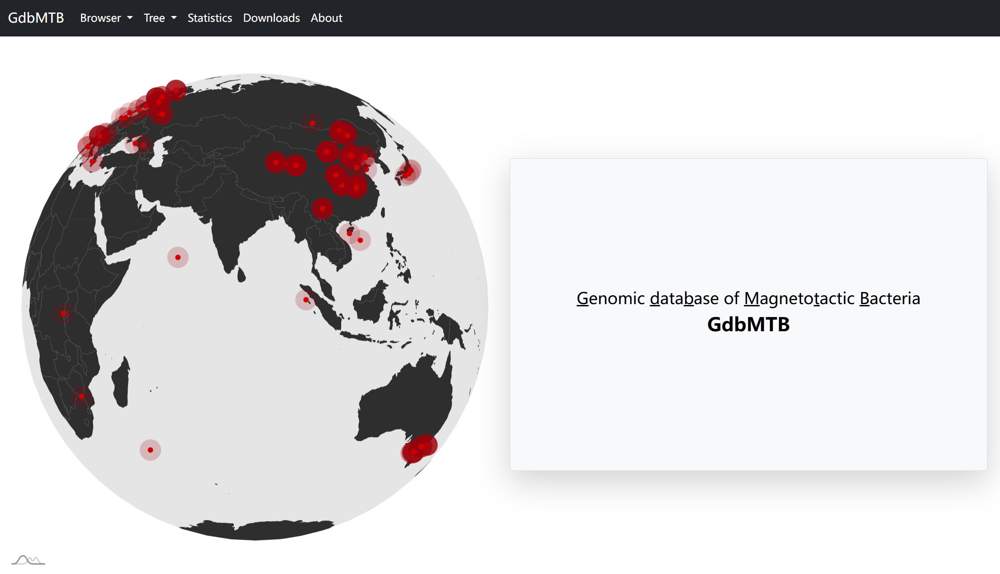

# GdbMTB: Genomic Database of Magnetotactic Bacteria

## Overview
GdbMTB (**G**enomic **d**ata**b**ase of **M**agneto**t**actic **B**acteria) is the first comprehensive, manually curated genomic resource dedicated to magnetotactic bacteria (MTB)—microorganisms that navigate using the Earth’s geomagnetic field via biomineralized magnetosomes. 

The database is accessible at **https://www.gdbmtb.cn/**.


## Note
This repository contains the codes and scripts used in the data collection, processing, visualization and website development of the GdbMTB database.
## Scripts
**scripts/:** Python scripts for data collection, and Jupyter Notebook ipynb file for data processing and visualization.

**scripts/retrieve_metadata_from_ncbi_assembly_reports_json.py:**  Extracts genome metadata from NCBI assembly reports.

**scripts/use_ncbi_entrez_api_get_reference.py**: Fetches publication metadata using NCBI Entrez utilities.

**scripts/data_processing_visualization.ipynb**: data processing and visualization.


## Usage
**Dependencies:** python, Biopython, pandas

```bash
python retrieve_metadata_from_ncbi_assembly_reports_json.py example_assembly_reports.json
# the example_assembly_reports.json file under scripts folder is the assembly reports generated using the ncbi-datasets-cli v14.4.0 with the ‘summary’ command
```

```bash
python scripts/use_ncbi_entrez_api_get_reference.py example_accessions.txt
# the example_accessions.txt file under scripts folder contains a list of NCBI assembly accessions.
```

## Data Availability
Genomes and Metadata: Archived in Zenodo[](https://doi.org/10.5281/zenodo.14876943) and ScienceDB[](https://doi.org/10.57760/sciencedb.21001).

## Citation
If you use GdbMTB or this repository in your research, please cite:
Ji, R., Pan, Y., & Lin, W. (2025). GdbMTB: A manually curated genomic database of magnetotactic bacteria. Scientific Data (in submission).

## Contact
For inquiries and advices, contact: jirunjia@gmail.com